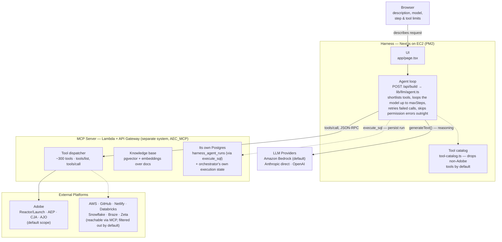

# Architecture

How a plain-English request in the browser turns into Adobe API calls: the
Next.js harness that picks tools and drives the model, the separate MCP
server that actually executes them, and the platforms it reaches on the
other side.

## Two paths leave the agent loop, and they go to different places

Reasoning and tool selection call an LLM provider directly — the MCP server
never sees that traffic. Actually *doing* anything in Adobe goes out as a
JSON-RPC `tools/call` to the MCP server, which is the only thing with real
Reactor, AEP, CJA, and AJO credentials. Even the harness's own run history
takes that same detour: it has no database of its own, so persisting a run
is itself an `execute_sql` call back into the MCP server's Postgres
instance.

## Harness (this repo)

A Next.js app with no fixed pipeline. A request doesn't run a predetermined
sequence of tools — the agent loop semantically shortlists a handful of
relevant tools, then lets the model decide what to call and in what order,
up to a configurable step budget.

- Model, tool-shortlist size, and step limit are all tunable per request
- Full end-to-end builds (`msb_execute_solution`) are opt-in only
- Runs on AWS EC2 under PM2; also ships to Vercel or Docker

## MCP Server (AEC_MCP, separate system)

The only thing in this picture holding real credentials for Adobe, AWS,
GitHub, and the rest. The harness never talks to those platforms itself —
every action is a tool call across this boundary, which is also where the
~300-tool catalog and the knowledge base actually live.

- AWS Lambda behind API Gateway, called over HTTPS JSON-RPC
- Owns the harness's own run-history table, not just its own state
- Some tools return partial data (e.g. empty delegate schemas) — a known
  gap on the MCP side, not a harness bug

## External Platforms (what MCP actually calls)

Everything the MCP server can reach is not everything the harness will use.
By default the tool catalog is filtered to Adobe only — AWS, GitHub,
Netlify, Databricks, Snowflake, Braze, and Zeta stay reachable at the MCP
layer but never reach the model's shortlist.

- `ADOBE_TOOLS_ONLY=false` restores the rest, no rebuild required
- Publishing to Adobe Reactor still ends in a manual approval step today —
  there's no `submit`/`approve`-adjacent tool that can link a library to an
  environment after the fact

---

*Reconstructed from live agent traces, Aug 2026. See also
[`ENVIRONMENT_VARIABLES.md`](./ENVIRONMENT_VARIABLES.md) and
[`DEPLOYMENT_GUIDE.md`](./DEPLOYMENT_GUIDE.md).*
