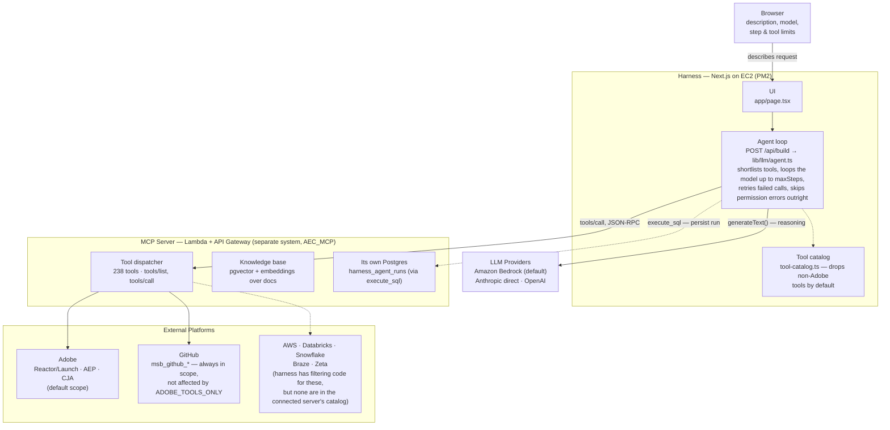

# Architecture

How a plain-English request in the browser turns into Adobe API calls: the
Next.js harness that picks tools and drives the model, the separate MCP
server that actually executes them, and the platforms it reaches on the
other side.

## Two paths leave the agent loop, and they go to different places

Reasoning and tool selection call an LLM provider directly — the MCP server
never sees that traffic. Actually *doing* anything in Adobe goes out as a
JSON-RPC `tools/call` to the MCP server, which is the only thing with real
Reactor, AEP, and CJA credentials. Even the harness's own run history
takes that same detour: it has no database of its own, so persisting a run
is itself an `execute_sql` call back into the MCP server's Postgres
instance.

## Harness (this repo)

A Next.js app with no fixed pipeline. A request doesn't run a predetermined
sequence of tools — the agent loop semantically shortlists a handful of
relevant tools, then lets the model decide what to call and in what order,
up to a configurable step budget.

- Model, tool-shortlist size, and step limit are all tunable per request
- There is no full, end-to-end build tool — every request resolves through
  specific, narrow tool calls the agent chooses itself
- Runs on AWS EC2 under PM2; also ships to Vercel or Docker

## MCP Server (AEC_MCP, separate system)

The only thing in this picture holding real credentials for Adobe and
GitHub. The harness never talks to those platforms itself — every action is
a tool call across this boundary, which is also where the tool catalog
(238 tools as of the last source-level check — Schema Registry classes/
field groups/data types/descriptors, batch ingestion, real-time customer
profile, sandbox management, identity namespaces, privacy jobs,
segment/export/estimate jobs, the rest of Flow Service (flow specs,
single connection spec fetch, landing zone, enable/disable), and the
Data Prep mapping-set API were added on top of the prior 139; the Lambda
still needs a `sam deploy` from the MCP repo before `tools/list` reflects
them live) and the knowledge base actually live.

- AWS Lambda behind API Gateway, called over HTTPS JSON-RPC
- Owns the harness's own run-history table, not just its own state
- Some tools return partial data (e.g. empty delegate schemas) — a known
  gap on the MCP side, not a harness bug

## External Platforms (what MCP actually calls)

By default the tool catalog is filtered to Adobe only (`ADOBE_TOOLS_ONLY`).
GitHub's `msb_github_*` tools aren't affected by that filter — they're
always in scope, since the agent's code-reading and commit tools need them
regardless of what else a request touches.

The harness's tool-catalog filtering code also has an exclusion list for
AWS, Databricks, Snowflake, Braze, and Zeta tools — but as of the last live
`tools/list` check, none of those actually exist in the connected MCP
server's catalog, so today that part of the filter has nothing to exclude.
`ADOBE_TOOLS_ONLY=false` disables the filter entirely if that changes.

- Publishing to Adobe Reactor still ends in a manual approval step today —
  there's no `submit`/`approve`-adjacent tool that can link a library to an
  environment after the fact
- There are no dedicated AJO (journey/offer) tools either — the knowledge
  base covers AJO documentation, but nothing here creates or manages a
  journey

---

*Reconstructed from live agent traces and a direct tools/list comparison,
Aug 2026. See also [`ENVIRONMENT_VARIABLES.md`](./ENVIRONMENT_VARIABLES.md)
and [`DEPLOYMENT_GUIDE.md`](./DEPLOYMENT_GUIDE.md).*
